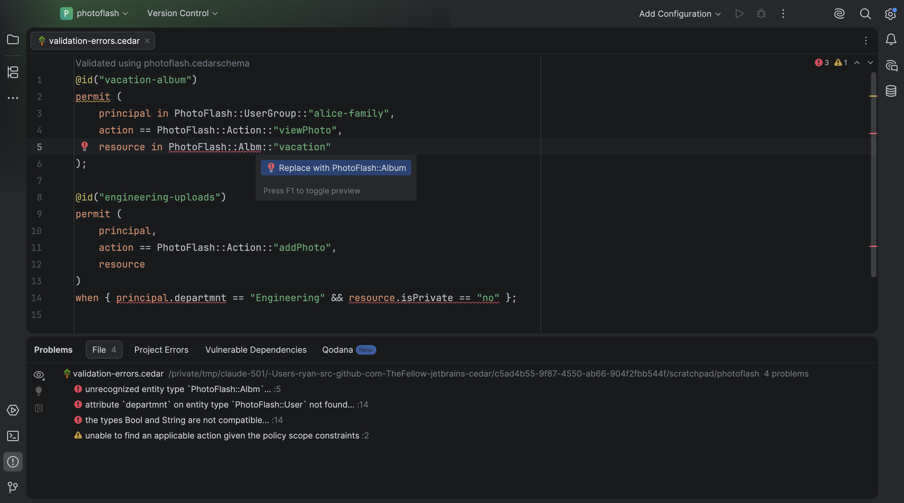

# Cedar policy language for JetBrains IDEs

[](https://plugins.jetbrains.com/plugin/34560-cedar)
[](https://plugins.jetbrains.com/plugin/34560-cedar)

Cedar policy language support for IntelliJ-based IDEs (GoLand, IntelliJ IDEA, PyCharm, WebStorm, …):
syntax highlighting, formatting, validation, completion and navigation.

This plugin is a **semantic port** of the official
[Cedar extension for Visual Studio Code](https://github.com/cedar-policy/vscode-cedar) (`cedar-policy/vscode-cedar`),
with the same features, and it is kept in step with upstream through a ledger-driven porting process
([`semport/`](semport/README.md)). It currently tracks vscode-cedar **0.10.6** with **Cedar SDK 4.13.0**.

Cedar is an open-source language for writing authorization policies and making authorization decisions based on
those policies. See the [Cedar policy language reference guide](https://docs.cedarpolicy.com/).

The Cedar SDK (Rust) runs inside the IDE as WebAssembly on a pure-Java runtime ([Chicory](https://chicory.dev)),
so validation, formatting and translation give the same results as the VS Code extension and the `cedar` CLI,
with no native binaries.



## Features

### Cedar policy language

Files matching `*.cedar` are Cedar policies. They get syntax highlighting and are validated as you edit, when
formatting, and from the context menu. Completion covers entity types, attributes, actions, functions,
annotations and snippets. Formatting can be disabled per file with a leading `// @formatter:off` comment line.
Navigate policies with the Structure view and breadcrumbs, and use **Go to Declaration** on entity types and
action names. Policies can be exported to their JSON form (`*.cedar.json`), which is highlighted too.

### Cedar schema

Files named `cedarschema` or matching `*.cedarschema` are Cedar schemas, with extra highlighting. They are
validated as you edit and from the context menu. When a schema is detected (auto-detected in the policy's folder
or the project root) or configured in settings, Cedar policies and entities are also validated against it, and a
**Validated using …** hint appears at the top of the file. Entity types show in the Structure view, and
**Go to Declaration** works on entity types and action names. The Cedar schema JSON format is supported for
files named `cedarschema.json` or matching `*.cedarschema.json`. Schemas translate between the two formats, and
JSON schemas export to PlantUML or Mermaid class diagrams (experimental).

### Cedar entities

Files named `cedarentities.json` or matching `*.cedarentities.json` are Cedar entities, with extra highlighting.
They are validated against the Cedar schema. Completion suggests entity types, and **Add Cedar Entity** inserts
a template for a type. Entities show in the Structure view; **Go to Declaration** works on entity types.

### Cedar CLI

Files named `cedarauth.json` / `*.cedarauth.json` (input to `cedar authorize --request-json`) and
`cedartemplatelinks.json` / `*.cedartemplatelinks.json` (input to `--template-linked`) get extra highlighting.

### Markdown

`cedar` and `cedarschema` fenced code blocks in Markdown files are highlighted.

### Commands

All commands are under **Tools | Cedar** and in **Find Action** (type *Cedar*); the file-specific ones are also
in the editor context menu: Validate Cedar Policy, Export Cedar Policy as JSON, JSON (preview), Open Cedar
Schema, Validate Cedar Schema, Translate Cedar Schema, Export Cedar Schema, Validate Cedar Entities, Add Cedar
Entity, Clear Problems, About, and Open docs.cedarpolicy.com.

### Settings

**Settings | Tools | Cedar** (per project):

- **Schema file**: the Cedar schema used for policy validation, relative to the project root (`cedar.schemaFile`).
- **Auto detect Cedar schema file** (`cedar.autodetectSchemaFile`, on by default).

Formatting uses the Cedar code style (**Settings | Editor | Code Style | Cedar**): indent (default 4) and hard
wrap column (default 80), matching VS Code's `editor.tabSize` / `editor.wordWrapColumn` defaults.

## Install

Requirements: an IntelliJ-based IDE **2026.2** or newer.

Install **Cedar** from the [JetBrains Marketplace](https://plugins.jetbrains.com/plugin/34560-cedar), or in the IDE:
**Settings | Plugins | Marketplace**, search for "Cedar", and install it.

### Sideload

1. Build the plugin (or download `plugin` from a CI run):

   ```sh
   mise install          # Java 25, Gradle, Rust + wasm32-wasip1 target, Python, Node (see mise.toml)
   ./gradlew buildPlugin
   ```

   This produces `build/distributions/jetbrains-cedar-<version>.zip`.
2. In GoLand: **Settings | Plugins | ⚙ | Install Plugin from Disk…**, pick the zip, and restart the IDE.

To try it without touching your IDE installation, `./gradlew runIde` opens a sandboxed GoLand with the plugin.
Builds compile against `/Applications/GoLand.app` when present (see `gradle.properties`), otherwise they
download GoLand `2026.2.3`.

## Differences from the VS Code extension

- Validation runs continuously in the editor (the IntelliJ daemon) instead of on open/save; the results are
  the same and appear in the editor and the Problems tool window.
- `:::code{language=cedar}` Markdown directive blocks are not highlighted (only fenced code blocks are).
- **Activate Cedar Extension** is kept for parity but is a no-op: the plugin is always active.
- The JSON preview opens as a read-only editor tab with an **Open <file>** banner in place of a code lens.

## Releasing

1. Set `pluginVersion` in `gradle.properties` and add a matching `## <version> - <date>` section to
   `CHANGELOG.md` (it becomes the Marketplace "What's New").
2. Commit, then tag and push: `git tag v<version> && git push origin v<version>`.
3. The `release` workflow tests and verifies the plugin, publishes it to the JetBrains Marketplace (needs the
   `PUBLISH_TOKEN` repository secret: a Marketplace personal access token) and creates a GitHub release
   with the zip.

Versions track upstream (`0.10.6` = vscode-cedar 0.10.6); plugin-only releases add a fourth component
(`0.10.6.1`). Check Marketplace compatibility locally with `./gradlew verifyPlugin -PverifyLocalOnly`
(against the installed GoLand) or `./gradlew verifyPlugin` (downloads GoLand and IntelliJ IDEA).

## Development

See [AGENTS.md](AGENTS.md) for the layout and conventions, and [semport/README.md](semport/README.md) for how
upstream changes are ported (`/semport` in Claude Code, or the Attractor graph).

## License

Apache-2.0. See [LICENSE](LICENSE) and [NOTICE](NOTICE).
